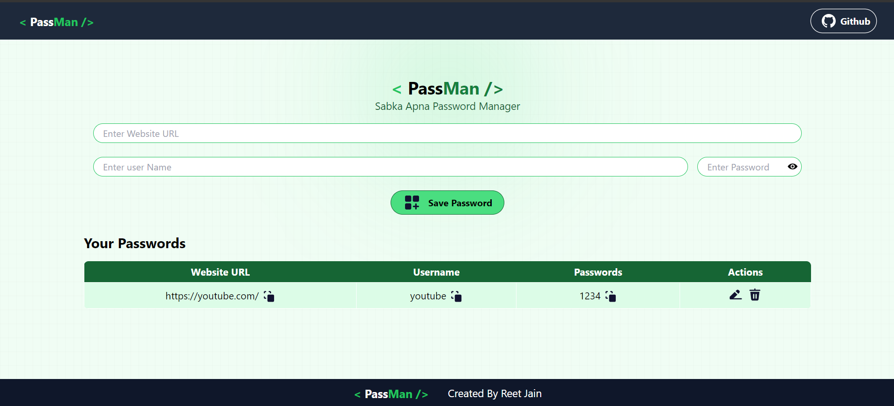

# PassMan - Password Manager



## Introduction

PassMan is a secure and user-friendly password manager built with React. It allows users to store and manage their passwords safely. The application securely saves website URLs, usernames, and passwords with all necessary security measures.

## Features

<ul>
<li><b>Secure Storage:</b> All passwords are encrypted and stored securely.</li>
<li><b>Password Management:</b> Helps in Managing all the password as it stores locally as well as on database.</li>
<li><b>Responsive Design:</b> Fully responsive and works on all devices.</li>
<li><b>Easy to Use:</b> Simple and intuitive interface for managing passwords.</li>
</ul>


## Getting Started

Follow these instructions to get a copy of the project up and running on your local machine for development and testing purposes.

### Prerequisites

Make sure you have the following installed on your system:

- Node.js
- npm (Node Package Manager)


### Installation

1. **Clone the repository**
   ```sh
   git clone https://github.com/reetjain01/PassMan.git

2. **Navigate to the project directory**
   ```sh
   cd passMan

3. **Install dependencies**
   ```sh
   npm install

## Running the Application


1. **Start the development server**
   ```sh
   npm run dev

2. Open your browser and navigate to http://localhost:5173 to see the application running.


    
## Usage
- Add New Entry: Add a new password entry by providing the website URL, username, and password.
- View and Manage Entries: View, edit, or delete your saved password entries.
  
## Security
PassMan uses the following measures to ensure the security of your passwords:

 - Encryption: All passwords are encrypted before being stored.
 - Authentication: User authentication to ensure data privacy.
 - Secure Storage: Secure methods are used to store encrypted passwords.

## Contributing
Contributions are welcome! Please fork this repository and submit a pull request for any improvements or bug fixes.

## License
This project is licensed under the MIT License. See the LICENSE file for details.

## Contact
If you have any questions or suggestions, feel free to contact me at jainreet112@gmail.com.


